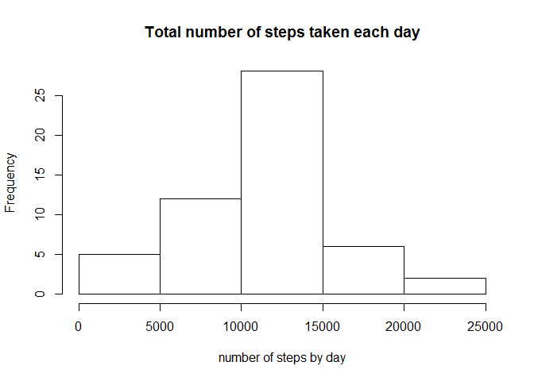
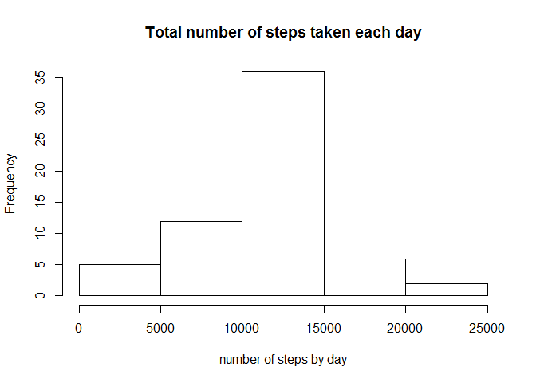

# Reproducible Research: Peer Assessment 1


## Loading and preprocessing the data
The **activity.csv** data file containing the observations is read and the **act** dataset is created:

```r
act <- read.csv("/tmp/activity.csv")
```

The structure of the dataset is as follows:

```r
str(act)
```

```
## 'data.frame':	17568 obs. of  3 variables:
##  $ steps   : int  NA NA NA NA NA NA NA NA NA NA ...
##  $ date    : Factor w/ 61 levels "2012-10-01","2012-10-02",..: 1 1 1 1 1 1 1 1 1 1 ...
##  $ interval: int  0 5 10 15 20 25 30 35 40 45 ...
```

The existence of *not available* (NA) data is checked:

```r
anyNA(act$steps)
```

```
## [1] TRUE
```

```r
anyNA(act$date)
```

```
## [1] FALSE
```

```r
anyNA(act$interval)
```

```
## [1] FALSE
```
Therefore, NAs are present in the *steps* variable.


## What is mean total number of steps taken per day?
In order to perform this analysis, a new dataset is created, having an aggregation of the steps taken each day.
The aggregation function will be the *sum*, as we want to sum all the steps taken in a day:

```r
aggByDate <- aggregate(act["steps"], by=act["date"], FUN="sum")
str(aggByDate)
```

```
## 'data.frame':	61 obs. of  2 variables:
##  $ date : Factor w/ 61 levels "2012-10-01","2012-10-02",..: 1 2 3 4 5 6 7 8 9 10 ...
##  $ steps: int  NA 126 11352 12116 13294 15420 11015 NA 12811 9900 ...
```

What follows is a histogram showing the distribution of the total number of steps by day. It appears that the most common pattern is to walk between 10000 and 15000 steps by day.

```r
hist(aggByDate$steps, xlab="number of steps by day",
     main="Total number of steps taken each day")
```

 

Now, the mean and median are calculated, using the option na.rm=TRUE to ignore the NAs:

```r
mean(aggByDate$steps, na.rm=TRUE)
```

```
## [1] 10766.19
```

```r
median(aggByDate$steps, na.rm=TRUE)
```

```
## [1] 10765
```


## What is the average daily activity pattern?
In order to perform this analysis, a new dataset is created, having an aggregation of the steps taken by each of the 5-minutes interval during the day.
The aggregation function will be the *mean* in this case, as we want to have the average number of steps taken by increment:

```r
aggByInterval <- aggregate(act["steps"], by=act["interval"], FUN="mean", na.rm=TRUE)
str(aggByInterval)
```

```
## 'data.frame':	288 obs. of  2 variables:
##  $ interval: int  0 5 10 15 20 25 30 35 40 45 ...
##  $ steps   : num  1.717 0.3396 0.1321 0.1509 0.0755 ...
```
The average number of steps was computed for each of the 288 5-minute interval present in a day (i.e., 24hours * 60minutes / 5minutes = 288).

The time series plot of this aggregate dataset is:

```r
plot(aggByInterval, type="l", xlab="5-minute intervals", ylab="average steps",
     main="Average number of steps taken (averaged across all days)\nversus the 5-minute intervals")
```

 

The interval with the maximum number of steps, on average, is:

```r
subset(aggByInterval, steps==max(aggByInterval$steps))
```

```
##     interval    steps
## 104      835 206.1698
```


## Imputing missing values
As stated above, we know that there are NAs in the *steps* variable.
Specifically, the number of NAs in the original **act** dataset is:

```r
sum(is.na(act$steps))
```

```
## [1] 2304
```

In order to fill in the missing values, the following strategy will be adopted: each steps containing a NA value will be filled with 1/288 of the mean steps per day. The mean steps per day, as already calculated above is:

```r
mean(aggByDate$steps, na.rm=TRUE)
```

```
## [1] 10766.19
```
Therefore the missing value will be filled with the value:

```r
filler <- mean(aggByDate$steps, na.rm=TRUE) / 288
filler
```

```
## [1] 37.3826
```

First a new dataset **actNoNA** is created copying the original one:

```r
actNoNA <- act
```
Then the missing values are filled adopting the above mentioned strategy:

```r
actNoNA$steps[is.na(actNoNA$steps)] <- filler
```
No NAs are present now in the new dataset:

```r
anyNA(actNoNA)
```

```
## [1] FALSE
```

The analysis made with the dataset containing NAs is repeated for the new dataset.
First, the dataset is aggregated by date, summing up the steps for each day:

```r
aggByDateNoNA <- aggregate(actNoNA["steps"], by=actNoNA["date"], FUN="sum")
```
Then, a new histogram is generated and mean and median are recalculated (note that we don't need to use the na.rm=TRUE option now, because there are no NAs anymore in the dataset):

```r
hist(aggByDateNoNA$steps, xlab="number of steps by day",
     main="Total number of steps taken each day")
```

 

```r
mean(aggByDateNoNA$steps)
```

```
## [1] 10766.19
```

```r
median(aggByDateNoNA$steps)
```

```
## [1] 10766.19
```
Not surprisingly, because of the strategy adopted to fill in the missing values, the results are quite similar. The most common pattern is still to walk between 10000 and 15000 steps, the mean is unchanged, while the median is now equal to the mean.


## Are there differences in activity patterns between weekdays and weekends?
Let's add a new column to the **actNoNA** dataset that will be the factor differentiating weekends from weekdays:

```r
actNoNA$daytype <- "daytype"
```

The new variable is then filled with a different value according to the day of the week it refers to:

```r
for (i in 1:length(as.Date(actNoNA$date))) {
    actNoNA$daytype[i] <-
        ifelse (weekdays((as.Date(actNoNA$date[i], "%Y-%m-%d")), abbreviate=TRUE) %in% 
                    c("Mon", "Tue", "Wed", "Thu", "Fri"),
            "weekday", "weekend")
    }
```

Then, the variable is transformed into a factor:

```r
actNoNA$daytype <- factor(actNoNA$daytype)   
str(actNoNA)
```

```
## 'data.frame':	17568 obs. of  4 variables:
##  $ steps   : num  37.4 37.4 37.4 37.4 37.4 ...
##  $ date    : Factor w/ 61 levels "2012-10-01","2012-10-02",..: 1 1 1 1 1 1 1 1 1 1 ...
##  $ interval: int  0 5 10 15 20 25 30 35 40 45 ...
##  $ daytype : Factor w/ 2 levels "weekday","weekend": 1 1 1 1 1 1 1 1 1 1 ...
```
As visible from the structure of the new dataset, the new factor variable contains two values - *weekday* and *weekend*  - depending on the specific day.

Two subsets are created, one holding data related to weekdays and the other to weekends:

```r
actWD <- subset(actNoNA, daytype=="weekday")
actWE <- subset(actNoNA, daytype=="weekend")
```

Aggregated datasets are then created using the mean across the intervals; these will be used to generate the plot:

```r
aggWDbyInt <-aggregate(actWD["steps"],
          by=actWD["interval"],
          FUN="mean")
aggWEbyInt <- aggregate(actWE["steps"],
          by=actWE["interval"],
          FUN="mean")
```

Finally, the plot is generated:

```r
par(mfrow=c(2,1))
par(cex = 0.6)
plot(aggWDbyInt, axes=FALSE, type="l", main="Average number of steps taken (averaged across all days)versus the 5-minute intervals\n\nweekday", xlab="",
     ylab="average steps")
axis(2, col="grey40", col.axis="grey20", at=seq(0, 250, 50))
plot(aggWEbyInt, axes=FALSE, type="l", main="weekend", xlab="5-minute intervals",
     ylab="average steps")
axis(1, at=seq(0, 2500, 500))
axis(2, at=seq(0, 250, 50))
```

 

---
By comparing the two plots, one may get the idea that the observations are taken from a person having a sedentary work. In the central part of the weekdays the average number of steps is consistently lower than that performed during the weekends. The high activity during the weekends might also refer to the fact that the person is profiting of the weekends for fitness related activities.  
**end of document**


